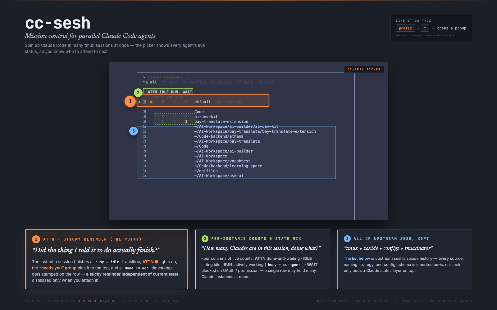

<h1 align="center">cc-sesh</h1>

<p align="center">
  <em>Mission control for parallel Claude Code agents — see every Claude instance's live status right inside the picker.</em>
</p>

<p align="center">
  <a href="https://opensource.org/licenses/MIT">
    
  </a>
  <a href="https://github.com/joshmedeski/sesh">
    
  </a>
</p>

<div align="center">

[English](README.md) | [简体中文](README.zh-cn.md)

</div>

<p align="center">
  
</p>

---

## Table of Contents

- [Quick start](#quick-start) — install + tmux config in 30 seconds
- [Commands](#commands)
- [Picker hotkeys](#picker-hotkeys)
- [Shell completion](#shell-completion)
- [Coexistence with upstream sesh](#coexistence-with-upstream-sesh)
- [Configuration](#configuration)
- [Credits & license](#credits--license)

## Quick start

### 1. Install

<details open>
  <summary><b>Homebrew</b> (recommended)</summary>

```sh
brew install Wingsdh/tap/cc-sesh
```

</details>

<details>
  <summary>Go install</summary>

```sh
go install github.com/Wingsdh/cc-sesh/v2@latest
```

Requires Go 1.25+.

</details>

### 2. tmux config

Append the block below to your `~/.tmux.conf` (or `$XDG_CONFIG_HOME/tmux/tmux.conf`):

```tmux
# === cc-sesh ===
# prefix + t — open the picker as a popup
bind-key "t" display-popup -E -w 80% -h 70% "cc-sesh picker -i"

# prefix + b — jump back to the previous session
bind-key "b" run-shell "cc-sesh last"

# Don't exit tmux when closing a session (so cc-sesh last has somewhere to go)
set-option -g detach-on-destroy off
```

Or as a one-liner, the whole thing:

```sh
cat >> ~/.tmux.conf <<'EOF'

# === cc-sesh ===
bind-key "t" display-popup -E -w 80% -h 70% "cc-sesh picker -i"
bind-key "b" run-shell "cc-sesh last"
set-option -g detach-on-destroy off
EOF
tmux source-file ~/.tmux.conf 2>/dev/null
```

### 3. Use it

Inside tmux, hit **`prefix + t`**. That's it.

> `-i` enables the source icons (requires a [Nerd Font](https://www.nerdfonts.com/)).

## Commands

```sh
cc-sesh picker          # open the built-in picker
cc-sesh list            # list every session source (tmux + config + zoxide + tmuxinator)
cc-sesh connect <name>  # connect to a session (creates it if absent)
cc-sesh last            # jump to the previous session
cc-sesh window          # list / switch / create windows in a session
```

`list / connect / window / pane / clone / root / last` semantics and flags match upstream sesh — see the [upstream usage docs](https://github.com/joshmedeski/sesh#how-to-use) for full details.

## Picker hotkeys

Inside the picker (no `fzf-tmux` wrapper required):

| Hotkey | Action |
|---|---|
| `Ctrl-a` | all sources (default) |
| `Ctrl-t` | tmux sessions only |
| `Ctrl-g` | `sesh.toml` configs only |
| `Ctrl-x` | zoxide history only |
| `Ctrl-f` | walk `$HOME` to depth ≤ 2 |
| `Ctrl-d` | kill the tmux session under cursor |
| `Alt-d`  | dismiss the ATTN flag on the current row (does not kill) |

## Shell completion

<details>
  <summary>Bash</summary>

```sh
cc-sesh completion bash > cc-sesh-completion.bash
sudo cp cc-sesh-completion.bash /etc/bash_completion.d/
source ~/.bashrc
```

</details>

<details>
  <summary>Zsh</summary>

```sh
cc-sesh completion zsh > _cc-sesh
sudo mkdir -p /usr/local/share/zsh/site-functions
sudo cp _cc-sesh /usr/local/share/zsh/site-functions/
source ~/.zshrc
```

</details>

<details>
  <summary>Fish</summary>

```sh
cc-sesh completion fish > ~/.config/fish/completions/cc-sesh.fish
source ~/.config/fish/config.fish
```

</details>

## Coexistence with upstream sesh

`sesh` and `cc-sesh` can be installed side-by-side — every name path is renamed:

|             | upstream sesh                       | cc-sesh                                                  |
| ---         | ---                                 | ---                                                      |
| binary      | `sesh`                              | `cc-sesh`                                                |
| Go module   | `github.com/joshmedeski/sesh/v2`    | `github.com/Wingsdh/cc-sesh/v2`                          |
| config dir  | `$XDG_CONFIG_HOME/sesh/`            | `$XDG_CONFIG_HOME/cc-sesh/`                              |
| config file | `sesh.toml`                         | `sesh.toml` (same filename)                              |
| state dir   | —                                   | `$XDG_STATE_HOME/cc-sesh/` *(attention state, fork-only)* |

> The attention state file lives at `$XDG_STATE_HOME/cc-sesh/attention.json` (default `~/.local/state/cc-sesh/attention.json`). Delete it any time to wipe all ATTN flags; the next picker open starts fresh.

## Configuration

The config file lives at `~/.config/cc-sesh/sesh.toml`. **The schema is identical to upstream sesh** — `[default_session]` / `[[session]]` / `[[wildcard]]` / `[tui]` / `blacklist` / `dir_length` / `sort_order` / `cache`, all of it works as-is.

For configuration syntax and examples, see the [upstream Configuration section](https://github.com/joshmedeski/sesh#configuration).

cc-sesh adds **no new configuration keys** — the Claude integration is zero-config and intentionally not configurable.

## Credits & license

cc-sesh is built on top of [**joshmedeski/sesh**](https://github.com/joshmedeski/sesh). Every piece of session management — tmux / zoxide / tmuxinator integrations, naming strategies, the configuration system, the picker — was designed and polished by Josh Medeski and the upstream contributors over years. Without sesh, there is no cc-sesh. ❤️

MIT, inheriting from upstream [sesh's LICENSE](LICENSE), copyright © 2023 Josh Medeski. Modifications by this fork are released under the same MIT license.
