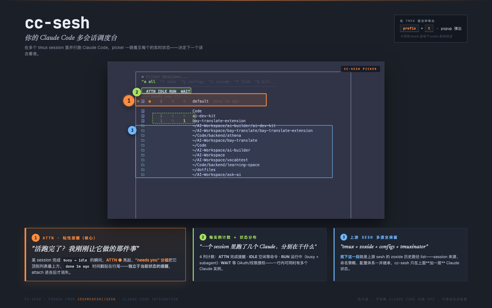

<h1 align="center">cc-sesh</h1>

<p align="center">
  <em>Claude Code 多会话调度台 —— 在 picker 里看见每个 tmux session 内的 Claude 实时状态。</em>
</p>

<p align="center">
  <a href="https://opensource.org/licenses/MIT">
    
  </a>
  <a href="https://github.com/joshmedeski/sesh">
    
  </a>
</p>

<div align="center">

[English](README.md) | [简体中文](README.zh-cn.md)

</div>

<p align="center">
  
</p>

---

## 为什么做这个？

在多个 tmux session 里并行跑 Claude Code 是个好习惯，但 sesh 的 picker 只显示 session **名字**，看不出每个 Claude 当前**在做什么**。结果你得挨个 attach 进去才能知道：那个 refactor 跑完了没？哪个卡在权限弹窗？谁还在思考？

cc-sesh 在 sesh picker 上叠一层 Claude 状态，让你一眼看见：

- 每个 session 里**有几个 Claude 实例**，分别**处于什么状态**——空闲、运行中、还是等 OAuth
- 任何一个 Claude 跑完一轮活时打一个**粘性 ATTN 提醒**，保证你不会错过「完成」
- 上游 sesh 该干的都没动——tmux + zoxide + configs + tmuxinator、命名策略、配置体系全部原样保留

## 目录

- [为什么做这个？](#为什么做这个)
- [快速开始](#快速开始) —— 安装 + tmux 配置一气呵成
- [命令](#命令)
- [Picker 内的 hotkey](#picker-内的-hotkey)
- [Shell 补全](#shell-补全)
- [与上游 sesh 共存](#与上游-sesh-共存)
- [配置](#配置)
- [致谢与 License](#致谢与-license)

## 快速开始

### 1. 安装

<details open>
  <summary><b>Homebrew</b>（推荐）</summary>

```sh
brew install Wingsdh/tap/cc-sesh
```

</details>

<details>
  <summary>Go install</summary>

```sh
go install github.com/Wingsdh/cc-sesh/v2@latest
```

需要 Go 1.25+。

</details>

### 2. tmux 配置

把下面这段贴到你的 `~/.tmux.conf`（或 `$XDG_CONFIG_HOME/tmux/tmux.conf`）：

```tmux
# === cc-sesh ===
# prefix + t —— 弹出 picker
bind-key "t" display-popup -E -w 80% -h 70% "cc-sesh picker -i"

# prefix + b —— 跳回上一个 session
bind-key "b" run-shell "cc-sesh last"

# 关闭 session 时不退出 tmux（这样 cc-sesh last 才有 session 可跳）
set-option -g detach-on-destroy off
```

或者一行命令直接追加并 reload：

```sh
cat >> ~/.tmux.conf <<'EOF'

# === cc-sesh ===
bind-key "t" display-popup -E -w 80% -h 70% "cc-sesh picker -i"
bind-key "b" run-shell "cc-sesh last"
set-option -g detach-on-destroy off
EOF
tmux source-file ~/.tmux.conf 2>/dev/null
```

### 3. 用起来

在 tmux 里按 **`prefix + t`** 即可。完事。

> `-i` 显示 src icon（需要 [Nerd Font](https://www.nerdfonts.com/)）。

## 命令

```sh
cc-sesh picker          # 打开内置 picker
cc-sesh list            # 列出所有 session 来源（tmux + config + zoxide + tmuxinator）
cc-sesh connect <name>  # connect 到 session（不存在则创建）
cc-sesh last            # 跳到上一个 session
cc-sesh window          # 列出 / 切换 / 新建当前 session 内的 window
```

`list / connect / window / pane / clone / root / last` 等子命令的语义与 flag 与上游 sesh 一致——详见 [上游 README](https://github.com/joshmedeski/sesh#how-to-use)。

## Picker 内的 hotkey

| Hotkey | 行为 |
|---|---|
| `Ctrl-a` | 全部来源（默认） |
| `Ctrl-t` | 仅 tmux session |
| `Ctrl-g` | 仅 `sesh.toml` 配置 |
| `Ctrl-x` | 仅 zoxide 历史 |
| `Ctrl-f` | 在 `$HOME` 下深度 ≤ 2 列目录 |
| `Ctrl-d` | kill 当前光标所指的 tmux session |
| `Alt-d`  | dismiss 当前行的 ATTN 标记（不 kill session） |
| `→` | 展开光标所在 session（仅 tmux 来源） |
| `←` | 折起 session（光标在 window 行时折起其所属 session 并收回光标） |
| `Ctrl-r` | 重取当前预览快照 |

终端宽度 ≥ 102 列（列表 60 + 间距 2 + 预览 40）才渲染预览分栏；拉宽终端会自动恢复。

## Shell 补全

<details>
  <summary>Bash</summary>

```sh
cc-sesh completion bash > cc-sesh-completion.bash
sudo cp cc-sesh-completion.bash /etc/bash_completion.d/
source ~/.bashrc
```

</details>

<details>
  <summary>Zsh</summary>

```sh
cc-sesh completion zsh > _cc-sesh
sudo mkdir -p /usr/local/share/zsh/site-functions
sudo cp _cc-sesh /usr/local/share/zsh/site-functions/
source ~/.zshrc
```

</details>

<details>
  <summary>Fish</summary>

```sh
cc-sesh completion fish > ~/.config/fish/completions/cc-sesh.fish
source ~/.config/fish/config.fish
```

</details>

## 与上游 sesh 共存

`sesh` 和 `cc-sesh` 每个名字路径都改了名，可以同机共存：

|              | 上游 sesh                            | cc-sesh                                                    |
| ---          | ---                                  | ---                                                        |
| 二进制       | `sesh`                               | `cc-sesh`                                                  |
| Go module    | `github.com/joshmedeski/sesh/v2`     | `github.com/Wingsdh/cc-sesh/v2`                            |
| 配置目录     | `$XDG_CONFIG_HOME/sesh/`             | `$XDG_CONFIG_HOME/cc-sesh/`                                |
| 配置文件名   | `sesh.toml`                          | `sesh.toml`（沿用文件名）                                  |
| 状态目录     | —                                    | `$XDG_STATE_HOME/cc-sesh/` *（attention 状态，fork 新增）* |

> attention 状态文件在 `$XDG_STATE_HOME/cc-sesh/attention.json`（默认 `~/.local/state/cc-sesh/attention.json`）。可随时手动删掉清空所有 ATTN 标记，下次 picker 打开会重新积累。

## 配置

配置文件在 `~/.config/cc-sesh/sesh.toml`。**配置 schema 与上游 sesh 完全一致** —— `[default_session]` / `[[session]]` / `[[wildcard]]` / `[tui]` / `blacklist` / `dir_length` / `sort_order` / `cache` 等都原样可用。

配置写法请直接看 [上游 README 的 Configuration 一节](https://github.com/joshmedeski/sesh#configuration)。

cc-sesh 本身**没有新增任何配置项** —— Claude 集成是开箱即用、不需要也不接受任何配置。

## 致谢与 License

cc-sesh 站在 [**joshmedeski/sesh**](https://github.com/joshmedeski/sesh) 的肩膀上。所有 session 管理 —— tmux / zoxide / tmuxinator 集成、命名策略、配置系统、picker —— 都是 Josh Medeski 与上游贡献者们多年打磨的成果。**没有 sesh，就没有 cc-sesh。** ❤️

MIT，沿袭上游 [sesh 的 LICENSE](LICENSE)，版权署名 © 2023 Josh Medeski。本仓库新增部分同样以 MIT 发布。
